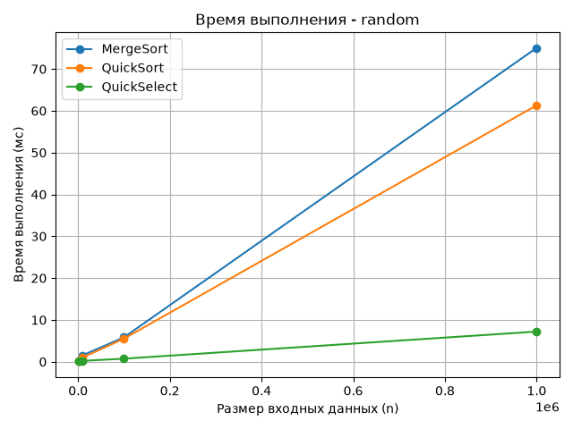
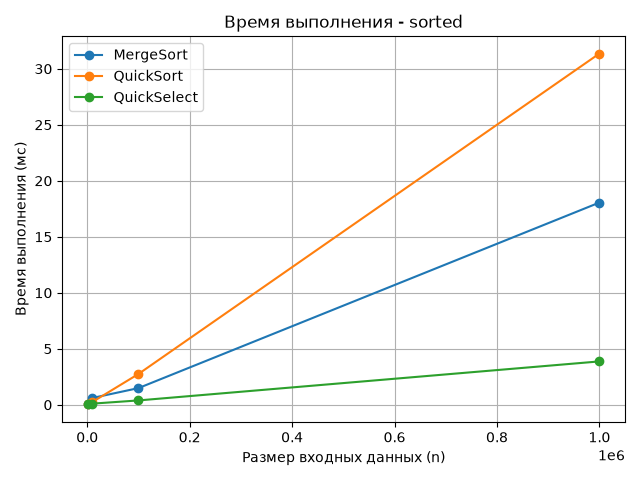
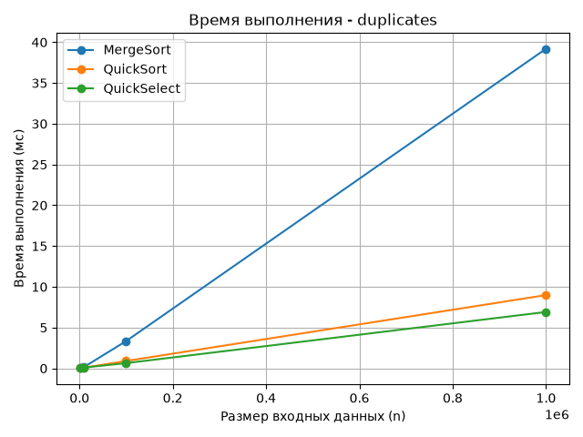
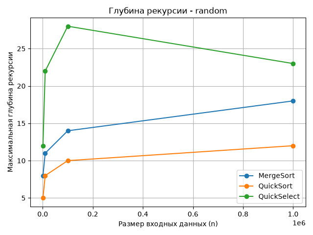
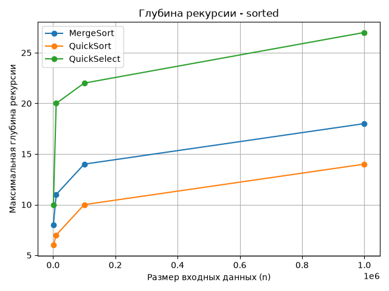
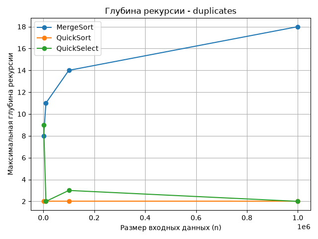
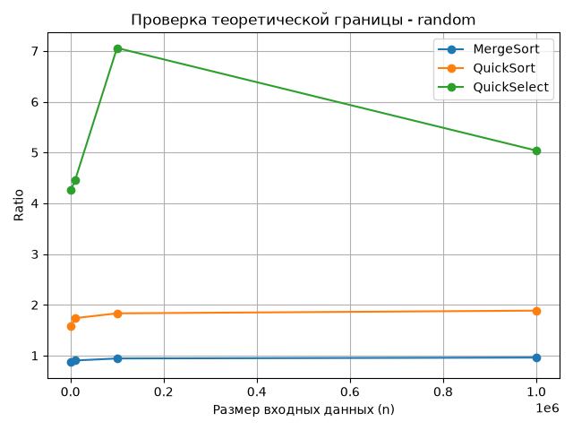
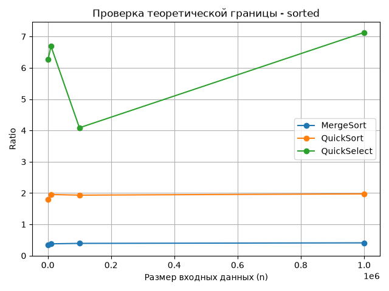
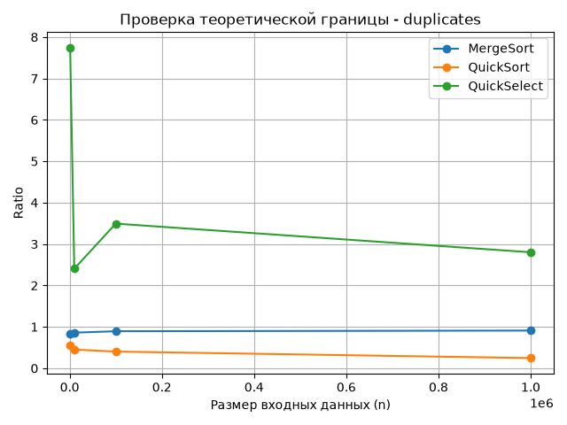

#Assignment 1 - Divide and Conquer & Asymptotic Notations

**Student:** Aida  
**Course:** Design and Analysis of Algorithms  
**Assignment:** 1 — Divide and Conquer & Asymptotic Notations

## 1. Introduction
- MergeSort
- QuickSort
- QuickSelect

### MergeSort

MergeSort divides the array into two parts, sorts them, and then merges them.
The recurrence is: T(n) = 2T(n/2) + Θ(n)

Its time complexity is:Θ(n log n)

Best case: Θ(n log n)  
Average case: Θ(n log n)  
Worst case: Θ(n log n)

MergeSort uses extra memory for merging.

### QuickSort
QuickSort chooses a pivot and divides the array into smaller, equal, and larger elements.

For a balanced partition:
T(n) = 2T(n/2) + Θ(n)

Average complexity: Θ(n log n)

Worst-case complexity: Θ(n²)

The implementation uses a random pivot and three-way partitioning.

### QuickSelect

QuickSelect finds the k-th smallest element without sorting the whole array.
Only one part of the array is processed after partitioning.

Average complexity: Θ(n)

Worst-case complexity: Θ(n²)

In this project, k = n/2, so we find the median element.

### Insertion Sort

Insertion Sort places elements in the correct position one by one.

Best case: Θ(n)

Average case: Θ(n²)

Worst case: Θ(n²)

It is useful for small subarrays because it is simple and fast for small inputs.

## 3. Experimental Setup

The algorithms were tested with 4 input sizes: 1,000, 10,000, 100,000 and 1,000,000.
Three input types were used: random, sorted and duplicates.
We measured execution time, comparisons and recursion depth. Results were saved in `results.csv`.

## 4. Experimental Results

The results show that all three algorithms worked correctly.
MergeSort had stable results for all input types. Its number of comparisons increased approximately as n log n.

QuickSort was fast on random and sorted data. It was especially fast on data with many duplicates because of three-way partitioning.

QuickSelect was generally fast because it processes only one part of the array. Its number of comparisons was close to linear growth.

The maximum recursion depth of QuickSort stayed below the required limit for n = 100,000.

### 4.1 Execution Time

### 4.2 Recursion Depth

### 4.3 Ratio Analysis

For MergeSort and QuickSort, the ratio was calculated as: comparisons / (n × log₂(n))

For QuickSelect, the ratio was calculated as: comparisons / n

## 5. Discussion

The experiments show that MergeSort has stable performance for different input types.
QuickSort worked well with duplicate values because three-way partitioning groups equal elements together.
QuickSelect was fast because it searches only one part of the array.
The experimental results generally agree with the theoretical complexity of the algorithms.

## 6. Conclusion

In this project, MergeSort, QuickSort and QuickSelect were implemented and tested.
The experiments showed how input size and input type affect algorithm performance.
The results were compared with the theoretical time complexity and recursion depth.
